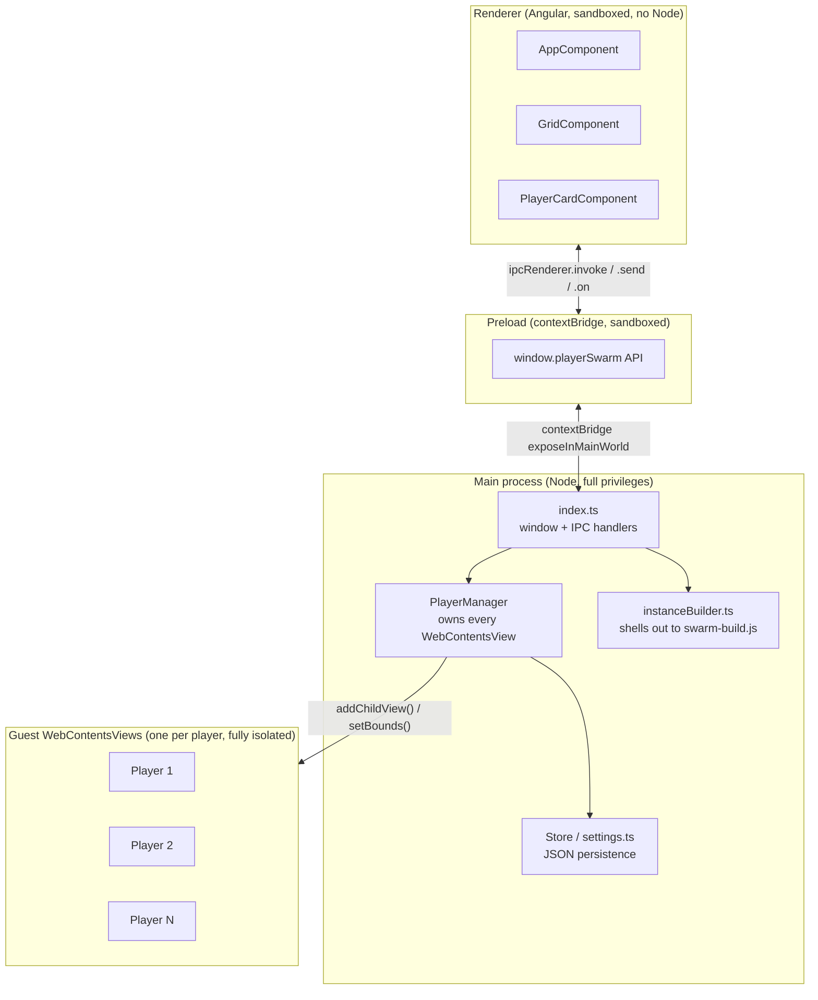
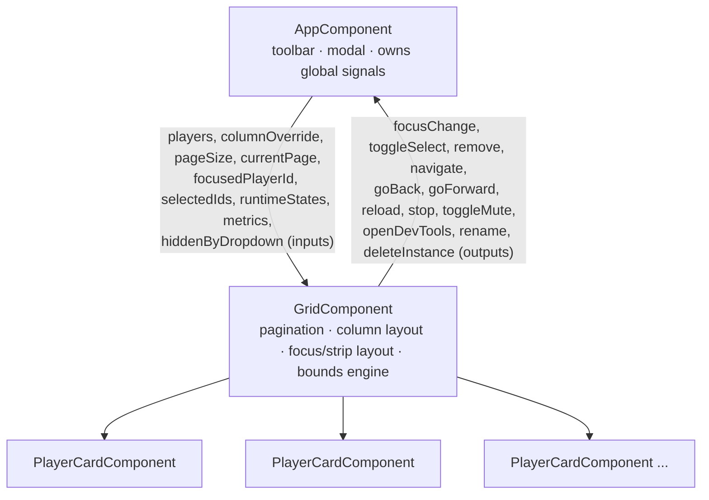
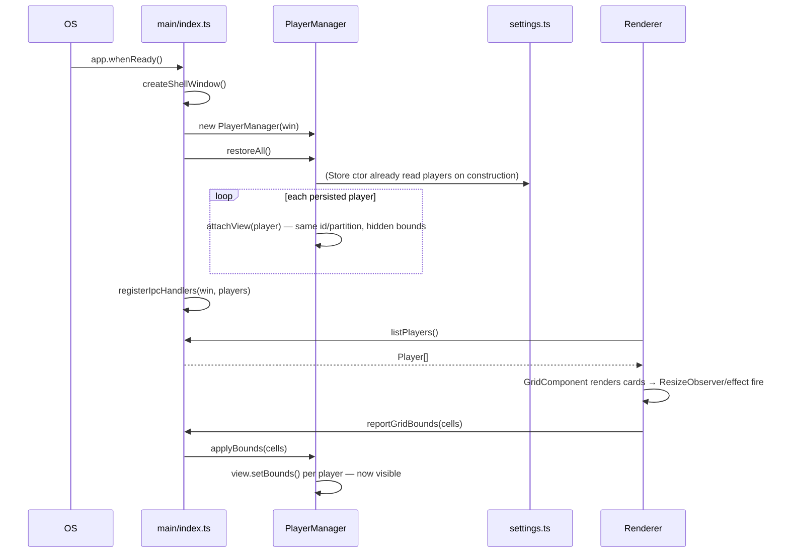
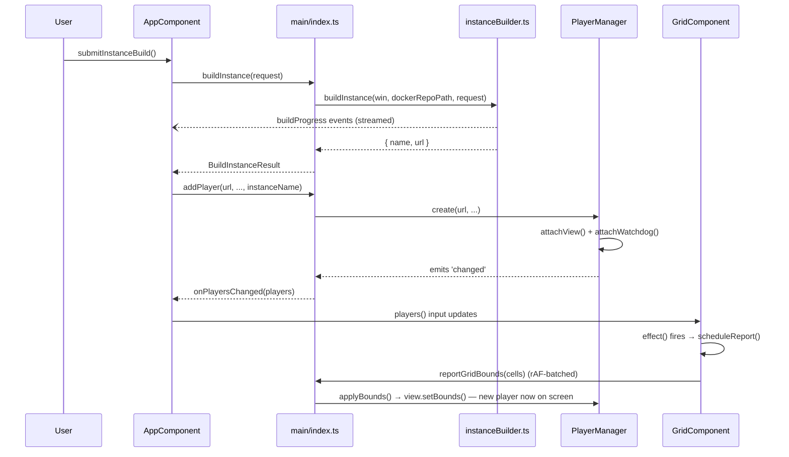
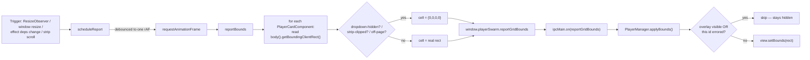

# Player Swarm Desktop — Architecture

Technical reference for how this app is built, how its processes are wired together, and how a UI action turns into a positioned Chromium instance on screen. Companion to [`README.md`](README.md) (stack rationale, known limits, measured memory).

## 1. Build/dev toolchain

The app is built with [`electron-vite`](https://electron-vite.org), which compiles three independent targets from one config (`electron.vite.config.ts`):

| Target     | Entry                      | Plugin(s)                       |
| ---------- | -------------------------- | ------------------------------- |
| `main`     | `src/main/index.ts` (auto) | `externalizeDepsPlugin()`       |
| `preload`  | `src/preload/index.ts`     | `externalizeDepsPlugin()`       |
| `renderer` | `src/renderer/index.html`  | `@analogjs/vite-plugin-angular` |

`externalizeDepsPlugin()` keeps `node_modules` as real `require()`s in main/preload instead of bundling them (they run under full Node, not a browser). The renderer target instead runs `@analogjs/vite-plugin-angular`, which compiles the Angular components through the Angular compiler on top of Vite.

**Why the renderer plugin is passed an explicit tsconfig path.** The plugin needs to know which `tsconfig.json` governs the Angular files it's compiling. This repo's root `tsconfig.json` is a solution-style file (it only references other configs, it has no `include`), so if the plugin were left to find a tsconfig on its own it would resolve the root file and see no included files at all. `electron.vite.config.ts` works around this by passing `tsconfig: resolve('tsconfig.web.json')` explicitly.

**Three tsconfigs, three jobs:**

- `tsconfig.node.json` — main + preload + shared. Extends `@electron-toolkit/tsconfig/tsconfig.node.json`, targets Node's module system.
- `tsconfig.web.json` — renderer + shared. Extends the web equivalent, enables `experimentalDecorators` (Angular decorators) and `useDefineForClassFields: false` (required for Angular's decorator-based field initialization to work correctly).
- Root `tsconfig.json` — solution file only, ties the two together for editor tooling; not used directly by any build step.

Both leaf configs map the `@shared/*` path alias to `src/shared/*`, which is how main-process code, preload code, and renderer code all import the same `Player`/`PlayerSwarmAPI`/`IPC` definitions from one file without relative-path spaghetti.

**Styling:** Tailwind CSS (`tailwind.config.js`) layered on top of `@ntv360/component-pantry`'s own preset (`presets: [require('@ntv360/component-pantry/tailwind-preset.js')]`), which supplies the design tokens (`accent`, `primary`, etc.) the component library's own classes reference. PostCSS (`postcss.config.js`) just chains `tailwindcss` + `autoprefixer` — nothing custom.

**npm scripts** (`package.json`):

- `npm run dev` → `electron-vite dev`. Builds all three targets, launches Electron, serves the renderer from an in-memory Vite dev server (`ELECTRON_RENDERER_URL`) with HMR.
- `npm run build` → `electron-vite build && electron-builder`. Production-bundles all three targets to `out/`, then `electron-builder` packages a platform installer into `release/` per the `build` block at the bottom of `package.json`.
- `npm run typecheck` → runs `tsc --noEmit` twice, once per leaf tsconfig, since a single invocation can't apply two different `compilerOptions` sets.

## 2. Process architecture

Electron's standard three-process split, strictly enforced here:



- **Main** (`src/main/`) owns the `BrowserWindow`, every `WebContentsView`, disk persistence, and all `ipcMain` handlers. Nothing here trusts the renderer with direct filesystem/process access — every action crosses through a named IPC channel.
- **Preload** (`src/preload/index.ts`) is the only file allowed to `require('electron')`'s `contextBridge`/`ipcRenderer`. It implements `PlayerSwarmAPI` (from `shared/types.ts`) by wrapping each method in the matching `ipcRenderer.invoke`/`.send`/`.on` call, and exposes the whole thing as `window.playerSwarm` — the renderer's _only_ way to reach anything outside its own sandbox.
- **Renderer** (`src/renderer/`) is a standalone Angular app (bootstrapped in `main.ts`, no Angular Router or NgModules). Runs with `contextIsolation: true`, `nodeIntegration: false`, `sandbox: true` — same as any hostile web page, restricted to whatever `window.playerSwarm` exposes.
- **Guest views** — see §3 — are their own separate `WebContentsView` instances, each with `contextIsolation`/`sandbox` on and, critically, **no preload script at all**. A player page has zero bridge back into this app.

## 3. The core constraint: `WebContentsView`, not a DOM element

Each "player" is a native `WebContentsView` (`playerManager.ts`, `attachView()`), attached to the shell window via `this.shell.contentView.addChildView(view)`. This is not an `<iframe>` or a `<webview>` tag — it's a separate OS-level compositor layer that Electron stacks **on top of** the window's own web-page (renderer) layer, unconditionally. There is no z-index, no CSS `position`, no Angular structural directive that can place renderer-drawn content above it.

Two consequences fall directly out of this, and together they explain nearly every non-obvious piece of code in `grid.component.ts` and `playerManager.ts`:

**1. Positioning is manual and continuous, not automatic.** A guest view's screen position is whatever the main process last called `view.setBounds({x, y, width, height})` with — it does not move on its own when the window resizes or the renderer's layout changes. So the renderer's job is to compute, on every layout-relevant change, where each player's placeholder `<div>` (`.player-card__body`) actually sits via `getBoundingClientRect()`, and ship that rectangle to main over IPC. This loop is `GridComponent`'s `scheduleReport()` → `reportBounds()` → `window.playerSwarm.reportGridBounds(cells)` → `ipcMain.on(IPC.reportGridBounds)` → `PlayerManager.applyBounds()` → `view.setBounds()`. See §6c for the full cycle.

**2. Renderer-drawn overlays are invisible unless a guest view is explicitly hidden first.** Since guest views always render above the renderer's DOM, any dialog, error card, or dropdown drawn in Angular would be covered by whichever player sits at that same screen location — not behind it, painted over it. This app handles that with three variations of the same trick (collapse the offending view(s) to `{x:0,y:0,width:0,height:0}` so the renderer content underneath becomes visible), scoped differently depending on how disruptive hiding should be:

| Situation                                              | Scope                                                                      | Mechanism                                                                                                                                                                                                                                                                                                                 |
| ------------------------------------------------------ | -------------------------------------------------------------------------- | ------------------------------------------------------------------------------------------------------------------------------------------------------------------------------------------------------------------------------------------------------------------------------------------------------------------------- |
| Add Player modal open                                  | every player, all at once                                                  | `AppComponent`'s `effect()` calls `setOverlayVisible(modalOpen())` → `PlayerManager.setOverlayVisible()` zeroes every view's bounds and restores `lastBounds` on close                                                                                                                                                    |
| A player crashes / fails to load / stops responding    | just that one player                                                       | `PlayerManager.setPlayerError()` zeroes only that view's bounds so the renderer's own error card (drawn in the same slot) shows through; `clearPlayerError()` restores it                                                                                                                                                 |
| A toolbar dropdown (`ntv-popover`) opens over the grid | only the players whose real rect the dropdown panel geometrically overlaps | `AppComponent.updateDropdownHiddenIds()` measures the popover panel's rect against every `[data-player-id]` element and populates `dropdownHiddenIds`; `GridComponent.reportBounds()` sends zero bounds for just those ids — nothing else in the grid resizes or moves                                                    |
| Thumbnail strip is scrolled                            | any thumbnail not fully inside the strip's visible viewport                | `reportBounds()` compares each card's rect against the strip container's rect and zeroes anything clipped, since a native view isn't clipped by a CSS `overflow` container the way real DOM is                                                                                                                            |
| Pagination — player is on another page                 | every id not in the current page                                           | `reportBounds()` explicitly zeroes every id not in `pagedPlayers()`, since a page-2 player has no `PlayerCardComponent` instance at all and would otherwise simply never be mentioned in a bounds report (and `applyBounds()` only touches ids it's told about — an omitted id keeps its last bounds, i.e. stays visible) |

A different technique — reserving real, measured CSS layout space the grid's own bounds math will never assign to a player (`.grid-mount--reserve-badge` padding) — is used for the one truly floating, indefinitely-present element (the "build in progress" badge), since a badge that must coexist with a full grid can't rely on the toggle-hide approach above.

## 4. IPC contract

`src/shared/types.ts` is the single source of truth, imported by all three processes via the `@shared/*` path alias. It defines the data shapes (`Player`, `PlayerRuntimeState`, `PlayerMetrics`, `CellBounds`, `BuildInstanceRequest/Result`, `BuildProgressEvent`, …), the `PlayerSwarmAPI` interface the preload script implements, and the `IPC` const object mapping every method to its literal channel string (e.g. `addPlayer: 'player:add'`) — so a typo in a channel name is a compile error, not a silent no-op at runtime.

The API surface, grouped by concern:

- **Player CRUD** — `addPlayer`, `addPlayers` (staggered batch), `removePlayer`/`removePlayers` (each resolves after a native confirm dialog with a Keep/Purge choice), `listPlayers`, plus the push channels `onPlayersChanged`/`onPlayerStateChanged` that main fires whenever `PlayerManager` emits `changed`/`state-changed`.
- **Navigation & per-player controls** — `navigatePlayer`, `goBackPlayer`/`goForwardPlayer`, `reloadPlayer`, `stopPlayer`, `setPlayerMuted`/`setAllPlayersMuted`, `openPlayerDevTools`, `renamePlayer`, `reloadAllPlayers`.
- **Metrics** — `getPlayerMetrics()`, polled by the renderer every 3s rather than pushed, since `app.getAppMetrics()` is cheap enough to just ask for on an interval.
- **Layout/overlay plumbing** — `reportGridBounds` (renderer → main, one-way `send`, fired continuously — see §6c) and `setOverlayVisible` (renderer → main, one-way `send`).
- **Settings** — `getGpuDisabled`/`setGpuDisabled` (GPU toggle, relaunches the app when packaged), `getDockerRepoPath`/`setDockerRepoPath`.
- **Instance building** (wraps `player-swarm-docker`'s `swarm-build.js`) — `pickZipFile`, `getPathForFile` (resolves a dropped `File`'s real disk path via `webUtils.getPathForFile`, called synchronously in preload rather than round-tripped over IPC), `buildInstance` + `onBuildProgress` (streamed NDJSON progress events), `deleteInstance`.

## 5. Renderer component tree and data flow



**`AppComponent`** is the state root. It holds every cross-cutting signal — `players`, `focusedPlayerId`, `selectedIds`, `columnOverride`, `pageSize`/`currentPage`, `runtimeStates`, `metrics`, `gpuDisabled`, the whole Add Player modal's state (`modalOpen`, `mode`, build progress) — and is the only component that talks to `window.playerSwarm` directly. Its constructor wires up the two push subscriptions (`onPlayersChanged`, `onPlayerStateChanged`) and the metrics poll, and one `effect()` ties `modalOpen()` to `setOverlayVisible()`. Toolbar dropdown overlap detection (`onPopoverShown`/`updateDropdownHiddenIds`) also lives here, feeding `dropdownHiddenIds` down as an input.

**`GridComponent`** is purely presentational plus the bounds-reporting engine (§6c). It derives `pagedPlayers` (slices `players()` by `pageSize`/`currentPage`), `dims` (column/row count — either `columnOverride` or an auto square-ish layout from `computeGridDimensions()`), `focusedPlayer`/`otherPlayers` (splits the list when something is maximized), and renders one of two template branches: the plain paginated grid, or the focus layout (one large `player-focus-main` + a scrollable `player-focus-strip` of thumbnails). It never calls `window.playerSwarm` itself for player actions — every user action is re-emitted upward as an `output()` for `AppComponent` to actually dispatch, keeping IPC calls in one place.

**`PlayerCardComponent`** is the per-player chrome: checkbox (multi-select), inline rename (double-click the label, `Enter`/blur commits, `Escape` cancels), the nav bar (back/forward, reload-or-stop depending on `runtimeState().loading`, a URL bar that syncs to the live post-navigation URL unless focused, mute toggle, DevTools), maximize toggle, the error card (shown when `runtimeState().error` is set, with a Reload button), and the footer's env/license/metrics readout. Its `.player-card__body` div (tagged `[data-player-id]`) is the empty placeholder the corresponding `WebContentsView` is positioned over — the component renders no actual player content itself.

## 6. Main-process subsystems

- **`PlayerManager`** — the single owner of every guest view's lifecycle. `create()`/`createMany()` (150ms-staggered) build a `Player` record and call `attachView()`, which constructs the `WebContentsView`, sets it hidden, adds it to the shell window, loads the URL, and wires `attachWatchdog()`. The watchdog tracks loading/nav-availability state (via `did-start-loading`/`did-stop-loading`/`webContents.navigationHistory`), persists the live URL on every navigation, and on `render-process-gone` calls `setPlayerError()` + `scheduleAutoRelaunch()` — a capped exponential backoff (1s → 2s → 4s → 8s → 16s, capped at `MAX_AUTO_RELAUNCH_ATTEMPTS = 5` attempts, after which only a manual Reload can recover it). `getMetrics()` cross-references `app.getAppMetrics()` (system-wide, keyed by OS pid) against each view's `webContents.getOSProcessId()` to build a per-player CPU/memory snapshot. `applyBounds()` is the landing point for every `reportGridBounds` IPC message.
- **`Store`** — an in-memory `Map<string, Player>` that mirrors `settings.json`'s persisted player list, read once at construction and written through on every `add`/`remove`/`update`.
- **`settings.ts`** — the actual JSON file I/O (`userData/settings.json`), synchronous `readFileSync`/`writeFileSync`, holding `dockerRepoPath`, `players`, and `gpuDisabled`. `getGpuDisabled()` is read directly (not via `Store`) because it must be checked before `app.whenReady()` even fires — `app.disableHardwareAcceleration()` only works if called before Chromium's GPU process has already started.
- **`instanceBuilder.ts`** — does not talk to Docker directly; it shells out to `player-swarm-docker/swarm-build.js` via `spawn(process.execPath, [...], { env: { ELECTRON_RUN_AS_NODE: '1' } })` (running the script under Electron's own Node runtime rather than depending on a system `node`). It parses one JSON object per stdout line as a `BuildProgressEvent` and forwards each to the renderer via `IPC.buildProgress`; raw stderr is forwarded too, tagged as `{phase: 'log'}`. `buildInstance()` resolves once a `{phase:'done', name, url}` line arrives; `deleteInstance()` follows the identical pattern for `--remove=<name>`.

## 7. End-to-end flows

### a) App startup



### b) Adding a player (Quick Instance shown; a plain URL add skips the build step)



### c) The continuous bounds-reporting loop

This is what keeps every guest view glued to its DOM placeholder. It fires on essentially any layout-relevant change — window resize, a player added/removed, focus mode toggled, a page turned, a dropdown opened, the thumbnail strip scrolled:



### d) Crash / recovery flow

```mermaid
sequenceDiagram
    participant Guest as Guest WebContents
    participant PM as PlayerManager
    participant Renderer

    Guest-->>PM: render-process-gone (reason != clean-exit)
    PM->>PM: setPlayerError(id, message)
    PM->>Guest: view.setBounds(0,0,0,0) — hides the crashed view
    PM-->>Renderer: state-changed (runtimeState.error set)
    Renderer->>Renderer: player-card__error card renders in the now-visible slot
    PM->>PM: scheduleAutoRelaunch(id)
    Note over PM: attempt count < 5? wait 2^attempt sec (capped 16s)
    PM->>Guest: view.webContents.loadURL(player.url)
    alt navigation succeeds
        Guest-->>PM: did-navigate
        PM->>PM: relaunchAttempts.delete(id); clearPlayerError(id)
        PM->>Guest: view.setBounds(lastBounds) — restored
        PM-->>Renderer: state-changed (error cleared)
    else fails again
        Guest-->>PM: render-process-gone (repeat, backoff doubles)
    end
    Note over PM: after 5 failed attempts, no more auto-retry —<br/>only a manual Reload (also clearPlayerError + resets the counter) can recover it
```
